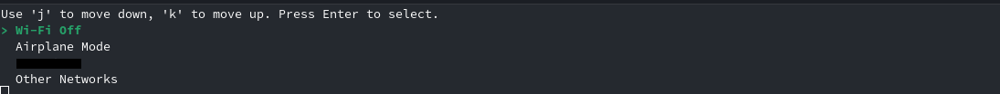

# what is this carbon functions?
carbon functions are simply things for my X1 Carbon laptop, which I wanted to build, because most of the time I am using my Laptop with just one shell and a Server Interface. Most of the time I just need the Shell for things like Python and Bash scripts where I don't need a real GUI for.
# Whats in here?
- battery
- display
- wifi
# how do I use your tools?
These are all tools you tipicaly put in your `home/user/bin` so you can execute them from everywhere!
## battery
battery is a simple tools which uses **Upower** to show you the battery Status and if it's plugged in or running from battey:  
in battery mode:
 
and in charging/plugged-in mode

## display
at the folder display there are three bash scipts, the one I am using currently is the `display` one, but there are also my two old scripts `display_on` and `display_off` all of them work with `systemctl isolate`. To turn the display on you have to type `sudo systemctl isolate graphical.target` to just use the server version of your OS (so just a Shell and nothing more) you have to type `sudo systemctl isolate default.target`  

### how do I use display?
if you want to do it like you see in this progamm, you have to do a view steps:  
- check default: `systemctl get-default` -> `grapical.target` should be the answer
- Set it to NON-GUI `sudo systemctl set default.target multi-user.target`
- reboot your system `sudo reboot` WANING you need to know your username ;)a
## Wi-fi
Wi-fi is an small Bash script, which can connect mi Laptop to an network over Bash!
It is not finished yet, because I want to make it more beautiful, but it works....
So I need less and less GUIs in my life. 
 

